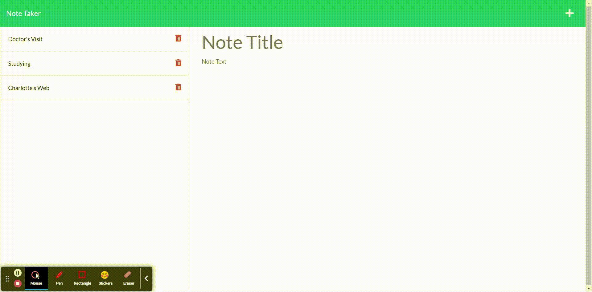

# A Moment To Note: A Note Taking Tool

## Table of Contents

- [Description](#description)
- [Installation](#installation)
- [Technologies](#technologies)
- [Video](#video)

## Description

This application allows the user to read, write and save notes through the power of backend means like Express.js.

## Installation

The application is deployable through Heroku [here](https://a-moment-to-note.herokuapp.com/)

## Technologies

- Express.js
- HTML
- CSS
- Javascript
- JSON
- UUID
- Insomnia (for test purposes)

## Video

